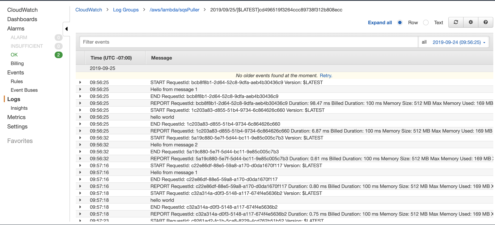

# Lab: SQS - Message Queues & Lambdas

## Overview
For this lab, you will be creating a few Message Queues and Broadcasters and wiring them through code.

## Feature Tasks

### Create 3 Standard Queues
- QueueA
- QueueB
- QueueC

### Features
- Create command line applications in Java that use these queues
- Queue Publisher, sends a message to a queue, using its ARN or URL
- Queue Client, receives messages from a Queue (by ARN) and displays them
- Create Lambda functions that are triggered by each of the 3 Queues
- Write your functions in Javascript
- They should perform the same task that your Java apps do
- Confirm that as you publish, you are seeing your app and the lambdas handle the queued messages at scale

## Credits and Contributions
- Ginger the dog
- @Bombibear
- Sapana Poudel
- Nhu Trinh
- Joachen Busch
- Brandon Hurrington
- Renee Messick
- Travis Cox
- Jack Kinne
- Marisha Hoza
- Chris Coulon
- Matt Stuhring
- Nick Paro
- Melfi Perez
- Padmapriva Ganapathi

## CloudWatch Logs
